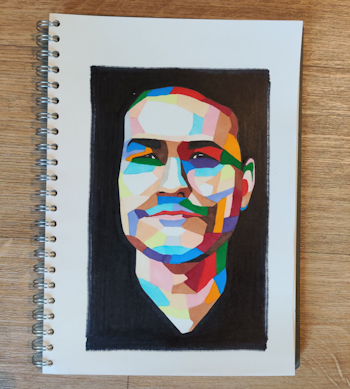

# About Me

Hello, I'm Roque, a software engineer on a mission to create new interesting, useful, cool stuff. My full name is
Alberto Roque Carrizo Fernández, and I was born in Spain in 1992. Ever since I can remember I've always had a practical
problem-solving mindset, and when I discovered coding, I was instantly hooked.

I earned my Bachelor's degree in computer science from Oviedo University. During my journey, I had the opportunity to
live and work in various cities, including Barcelona and Amsterdam, where I honed my skills and collaborated on exciting
projects. You can delve into more details in my [resume](/resume).

In this corner of the web, I intend to keep a log of the [projects](/projects) I'm currently working on
and share insights and tidbits in the form of [articles](/articles). My primary focus is on .NET and web development
technologies,
so you can expect a lot in that realm. For example the creation of this website itself had some interesting challenges,
which you can read more
about [here](/projects/portfolio-website).

In addition to my software engineering pursuits, I have a quite enjoy [drawing](/drawings). I've created a section here
to showcase my drawings (the decent ones that is!). It's my hope that this platform will motivate me to
draw more frequently, as it's a hobby I cherish.

I'm excited to have you along for this journey. Feel free to explore my work and don't hesitate
to get in touch at [{{ site.obfuscated_email }}]({{ site.obfuscated_mailto }}). Let's create, innovate, and explore
together!
