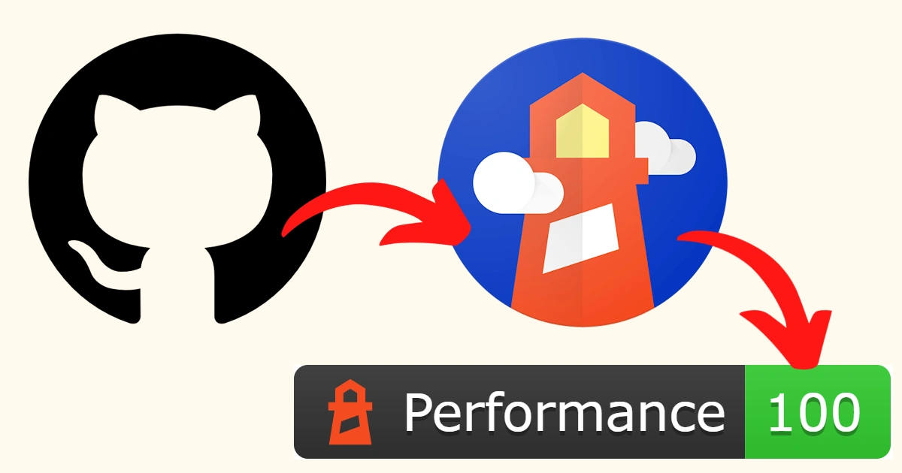

 

Want to get automated Lighthouse reporting for your website including badges in your README page? In this article I'll go into how to achieve this using GitHub Actions, GitHub Gists and Shields.io. You can find an example of this working on this website's GitHub repo [here](https://github.com/roquec/portfolio/blob/main/README.md).

