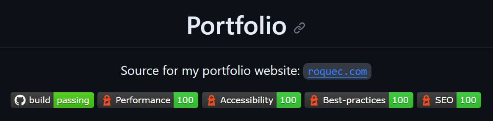

Ever noticed those snazzy badges on GitHub repositories showcasing website performance metrics and wished you could have them for your own site? Not only do they look cool, but they also offer a quick glance into the health of a project. In this article, I'll unravel the magic behind automating Lighthouse reports and effortlessly integrating them into your README page using GitHub Actions, Gists, and Shields.io.

You can see a working example for this website here:
<p>
  <a href="https://htmlpreview.github.io/?https://gist.githubusercontent.com/roquec/3f8ee5d85053832ea374a05b301f57aa/raw/report.html">
    </a>
  <a href="https://htmlpreview.github.io/?https://gist.githubusercontent.com/roquec/3f8ee5d85053832ea374a05b301f57aa/raw/report.html">
    </a>
  <a href="https://htmlpreview.github.io/?https://gist.githubusercontent.com/roquec/3f8ee5d85053832ea374a05b301f57aa/raw/report.html">
    </a>
  <a href="https://htmlpreview.github.io/?https://gist.githubusercontent.com/roquec/3f8ee5d85053832ea374a05b301f57aa/raw/report.html">
    </a>
</p>

* Working [README](https://github.com/roquec/portfolio/blob/main/README.md)
* Working [report](https://htmlpreview.github.io/?https://gist.githubusercontent.com/roquec/3f8ee5d85053832ea374a05b301f57aa/raw/report.html)

## The Context
### What is Lighthouse?

Lighthouse is a free, open-source, and automated tool from Google that helps developers improve the quality of web pages. It provides a comprehensive report on various parameters like performance, accessibility, SEO, best practices, and more. Think of it as an audit for your website – Lighthouse will highlight what we're doing right and where there’s room for improvement. Read more about [Lighthouse](https://developer.chrome.com/docs/lighthouse/overview/).


### What are status badges and Shields.io?

You know those fancy little badges you see on some GitHub repos indicating build status, coverage percentage, or other metrics? Those are status badges! They provide a visual representation of specific metrics and serve as a quick way to understand a repo’s status. Enter [Shields.io](https://shields.io/) - a service that allows you to create custom badges for practically anything, including Lighthouse metrics.



## The Challenge

If we want to have status badges for Lighthouse metrics on our GitHub README page we need multiple things:
* Run Lighthouse report on every new change
* Generate report with metrics we are interested in
* Have our badges display the latest data

One option would be to commit a change to our own repository every time to update the badges with the new data. While this works it is kind of messy and pollutes our commit history with a lot of automated extra commits. So we need a clean way to do this without changing the README file every time which means the badges need to get their data dynamically from somewhere.

## The Solution

My solution for this challenge? [GitHub Gists](https://gist.github.com/). Gists are like lightweight repos made for sharing code snippets and such. We can use one to publish our report and have our badges read data from it. We will leverage the [endpoint badge](https://shields.io/badges/endpoint-badge) for this. So the process now looks like this:
1. Run Lighthouse in GitHub Actions
2. Generate report files
3. Publish report files to a gist
4. Create endpoint badges

### 1. Running Lighthouse in GitHub Actions

Setting up GitHub Actions to run Lighthouse automatically pretty straightforward. You could use an already made action from the marketplace, I prefer to use the CLI directly and avoid the dependency. Here is a snippet of the workflow that runs the test:

```yaml
name: CI/CD
on:
  push:
    branches:
      - main
jobs:
  build:
    ...
  deploy:
    ...
  lighthouse:
    runs-on: ubuntu-latest
    needs: deploy
    steps:
      - name: Install Node.js v18
        uses: actions/setup-node@v4
        with:
          node-version: 18
      - name: Install Lighthouse CI
        run: npm install -g @lhci/cli@0.12.x
      - name: Run Lighthouse
        run: |
          lhci autorun --collect.numberOfRuns=5 --collect.url=https://roquec.com?v=${{github.run_id}} --upload.target=filesystem --upload.outputDir=./reports/mobile
          lhci autorun --collect.numberOfRuns=5 --collect.url=https://roquec.com?v=${{github.run_id}} --upload.target=filesystem --upload.outputDir=./reports/desktop --collect.settings.preset=desktop
```

* The `lighthouse` job needs `deploy` so it will run after the deployment is completed
* There are three steps, first we install `node`, then we install the `lighthouse cli` and finally we execute the `lighthouse commands`
* I use `--collect.numberOfRuns=5` to execute the test 5 times to get a reliable result. 
* I just target the landing page `https://roquec.com` but you target any pages you want.
* I add `?v=${{github.run_id}}` to avoid caching issues to ensure the last version is tested.
* Lastly you can use `--collect.settings.preset=desktop` to test the desktop version, otherwise it will test as mobile. 

You can find the full YAML file for this website [here](https://github.com/roquec/portfolio/blob/main/.github/workflows/ci-cd.yml).

### 2. Generate Lighthouse report with powershell

Now, to make the Lighthouse results usable by the [endpoint badge](https://shields.io/badges/endpoint-badge), we need to generate a JSON file. The schema is:

```
{ "schemaVersion": 1, "label": "hello", "message": "sweet world", "color": "orange" }
```

We already have the test results available from the previous step, we only need to process them to generate what we need. For this we will use a custom powershell script. We'll execute it right after the lighthouse test in our job:

```yaml
      - name: Generate Lighthouse report
        shell: pwsh
        run: .\.github\actions\lighthouse-report.ps1
        env:
          LIGHTHOUSE_PATH_MOBILE: ./reports/mobile
          LIGHTHOUSE_PATH_DESKTOP: ./reports/desktop
          LIGHTHOUSE_REPORT_OUTPUT_DIR: ./summary
```

We can use the following snippet to generate the JSON files:

```powershell
$manifest_desktop = Get-Content -Path (Join-Path -Path $reports_desktop -ChildPath "manifest.json") | ConvertFrom-Json

# Get data for summary
foreach($run in $manifest_desktop){
  if($run.isRepresentativeRun){
    $performance = $run.summary.performance * 100;
    $accessibility = $run.summary.accessibility * 100;
    $bestPractices = $run.summary.'best-practices' * 100;
    $seo = $run.summary.seo * 100;
    $report = $run.htmlPath;
    continue;
  }
}

# Creates a JSON badge file for shields.io
function WriteBadgeFile ([string] $label, [string] $message, [string] $color, [string] $file)
{
  $content = ("
  {
   `"schemaVersion`": 1,
   `"label`": `"$($label)`",
   `"message`": `"$($message)`",
   `"color`": `"$($color)`"
  }");
  new-item -force -path (Join-Path -Path $output_dir -ChildPath $file) -value $content -type file
}

# Generate all output files
WriteBadgeFile "Performance" $performance (GetScoreColor $performance) "performance.json"
WriteBadgeFile "Accessibility"  $accessibility (GetScoreColor $accessibility) "accessibility.json"
WriteBadgeFile "Best-practices"  $bestPractices (GetScoreColor $bestPractices) "best_practices.json"
WriteBadgeFile "SEO" $seo (GetScoreColor $seo) "seo.json"
```

Now we have a JSON file for each badge we want to create in our `./summary` folder. We are ready to publish them so the data is available to our badges.

You can check the full script I use [here](https://github.com/roquec/portfolio/blob/main/.github/actions/lighthouse-report.ps1) (keep in mind I'm doing some other things like printing the results in the GitHub actions step summary).

### 3. Using Gist to publish Lighthouse results

Gists are an easy way to share snippets of code or data. We'll use them to host our Lighthouse result JSON files. Here is how you can push the report files to a gist.
* Create a gist [here](https://gist.github.com/) and take note of the ID
* Set up an [access token](https://docs.github.com/en/authentication/keeping-your-account-and-data-secure/managing-your-personal-access-tokens) so your job is allowed to push to your gist
* Add a final step to the job to push the files to the gist (I use a custom powershell script for this)
```yaml
      - name: Publish reports to gist
        shell: pwsh
        env:
          UPDATE_GIST_TOKEN: ${{ secrets.GISTS_ACCESS_TOKEN }}
          UPDATE_GIST_ID: 3f8ee5d85053832ea374a05b301f57aa
          UPDATE_GIST_PATH: summary
        run: .\.github\actions\update-gist.ps1
```

You can find my `update-gist` script [here](https://github.com/roquec/portfolio/blob/main/.github/actions/update-gist.ps1)

### 4. Create Shields.io badges

Here comes the fun part!

* Head over to Shields.io and choose the [endpoint badge](https://shields.io/badges/endpoint-badge) type.
* For the URL, input the URL of the Gist containing your Lighthouse JSON result.
* Customize the badge appearance as you see fit.
* Embed the badge in your README. Now, every time Lighthouse runs and updates the Gist, your badge will reflect the new results!

Result:
<p>
  <a href="https://htmlpreview.github.io/?https://gist.githubusercontent.com/roquec/3f8ee5d85053832ea374a05b301f57aa/raw/report.html">
    </a>
  <a href="https://htmlpreview.github.io/?https://gist.githubusercontent.com/roquec/3f8ee5d85053832ea374a05b301f57aa/raw/report.html">
    </a>
  <a href="https://htmlpreview.github.io/?https://gist.githubusercontent.com/roquec/3f8ee5d85053832ea374a05b301f57aa/raw/report.html">
    </a>
  <a href="https://htmlpreview.github.io/?https://gist.githubusercontent.com/roquec/3f8ee5d85053832ea374a05b301f57aa/raw/report.html">
    </a>
</p>

### Extra

If you push the full HTML report from lighthouse to you gist too then you make the report available like [this](https://htmlpreview.github.io/?https://gist.githubusercontent.com/roquec/3f8ee5d85053832ea374a05b301f57aa/raw/report.html). You just need to get the raw HTML and pass it to `htmlpreview.github.io`:

```
https://htmlpreview.github.io/?https://gist.githubusercontent.com/<USER>/<GIST_ID>/raw/report.html
```

<video width="100%" preload="auto" muted autoplay loop>
    <source src="lighthouse_report.webm" type="video/webm"/>
</video>

## Conclusion
That’s it! With these steps, you've got an automated Lighthouse testing setup with nifty badges showcasing your website's performance. It's a little bragging, a little quality assurance, and a whole lot of geeky fun. Enjoy!

## References
* GitHub Actions: [https://github.com/features/actions](https://github.com/features/actions)
* Lighthouse: [https://developer.chrome.com/docs/lighthouse/overview/](https://developer.chrome.com/docs/lighthouse/overview/)
* Shields.io: [https://shields.io/](https://shields.io/)
