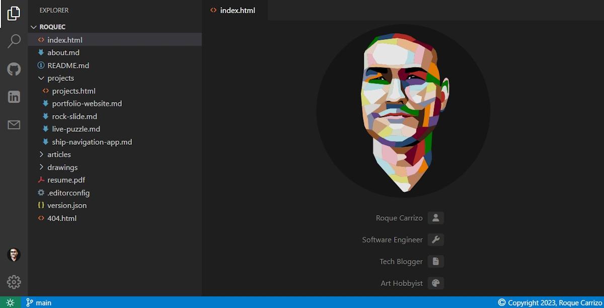

Welcome to my personal portfolio website, [roquec.com](https://roquec.com). This project serves as a showcase for my creative work and a platform for easy content management. Here, I'll provide insights into the creation process, the decisions I made, the challenges I encountered, and the solutions I implemented.

## Project Resources
* Source code: [github.com/roquec/portfolio](https://github.com/roquec/portfolio)
* Live website: [roquec.com](https://roquec.com)


## Motivation
My motivation for building this personal portfolio website was rooted in several key objectives:
* **Content Hub**: I needed a centralized space to store and display my diverse range of content, including projects, articles, and drawings.
* **Content Management**: A vital requirement was a smooth system for adding and managing new content effortlessly. I wanted to be able to just create a folder with markdown files and images and just push it.
* **Professional Presence**: Enhancing my online professional presence was a primary goal, making it easier for others to discover my work.
* **Innovation**: Even though there might be off-the-shelf options I wanted to create a custom project where I was in control and could implement unique features idea while also learning and exploring.

## Design
The design of my personal portfolio website was guided by my vision of a markdown-based static website and led to the following design choices:

* **Jekyll Framework**: Jekyll, with its markdown support and simplicity, was the ideal choice to bring my vision to life of a markdown-centric website.
* **Visual Inspiration**: I realized my plan for a simple "create markdown files and push them" site aligned with the design of a code editor pretty well. So I thought it would be fun to make my site look like VS Code.
* **Hosting Platform**: Given the static nature of the site, hosting it on GitHub Pages was the most logical and efficient choice.

## Implementation
The implementation of the website encompassed various aspects, including:
* **Jekyll Configuration** to align with my needs.
* **State and JavaScript** to get the app feel and functionality.
* **SASS and Styling** to emulate the code editor aesthetic.
* **Mobile Responsiveness** to make it usable on any device.


### Jekyll Configuration
Although Jekyll is straightforward it is convention based and opinionated in certain aspects, I had to tinker with its configuration to align with my vision. My final setup separates all user content from the website's design and structure assets. Here is the folder structure:

```
src
 |--_html
 |--_js
 |--_sass
 |--assets
 |--content
      |--_articles
      |--_drawings
      |--_projects
          |--live-puzzle
          |--portfolio-website
              |--index.md
              |--thumbnail.webp
              |--site_image.webp
```

As you can see I created a `content` folder to hold all user generated content and then 3 collections for each type of content. I then create one folder for each page with an `index.md`, a `thumbnail.wepb` and any other asset needed for the post. This differs from the usual Jekyll way where you would just create your markdown file with the name of your post and keep the images in the `assets` folder. I prefer my setup since it keeps everything together for each post and since the final file is always called `index.html` the routes can exclude that part leaving a clean:

```
https://roquec.com/projects/portfolio-website
```

### State and JavaScript

Another interesting challenge was to keep the state smoothly through page navigations. If this was an SPA the solution is trivial since only the content would change and there would not be a real navigation. Since I wanted a simple static website and to avoid big Single Page Application (SPA) frameworks the solution was a bit trickier.

After quite a bit of testing I arrived at my current solution using `MutationObserver` to assign the needed state styles to an element as soon as it is added to the DOM. This avoids flickering and maintains a smooth app-like feel through page navigations.

I go deeper into this problem and solution in [Maintaining state through navigation in a smooth spa-like way in a static website](/articles/2023-10-14-smooth-state-through-navigation-in-mpa).

<video width="100%" preload="auto" muted autoplay loop>
    <source src="video.webm" type="video/webm"/>
</video>

### SASS and Styling

The whole site styling is custom-made using SASS to imitate VS Code design. The fact that VS Code is built using Electron was advantageous since it's already made as a browser app with CSS. Being able to actually open VS Code in the browser (through `github.dev` for example) was very helpful to check colors, fonts and measurements.

I used [fontello](https://fontello.com/) to compile just the icons needed in a custom font file.

The site is fully responsive and usable in mobile devices. Main differences are that for smaller screens the menu panel is not resizable but takes most of the screen automatically and the tabs are hidden. Sizes and spacing are adjusted too for a better experience depending on screen width.

## Deployment
For seamless deployment and performance optimization, I employed the following strategies:

### GitHub Actions
Using GitHub Actions for the CI/CD pipeline was the obvious solution since I was already going to host the site in GiHub Pages and the source code on GitHub. The workflow triggers automatically on every push to `main`. It does the following:
1. Sets placeholders with custom script
2. Builds Jekyll site (generates HTML pages)
3. Sets caching hashes
4. Publishes page to GitHub pages
5. Runs Lighthouse tests
6. Publish Lighthouse report

You can find the YAML for the workflow [here](https://github.com/roquec/portfolio/blob/main/.github/workflows/ci-cd.yml).


### Asset Caching
By default, GitHub Pages caches everything for 10 minutes. This is a very shor cache for some assets like images that do not change often. Since there is no possibility to customize the caching configuration on GitHub Pages I decided to include [Cloudflare](https://www.cloudflare.com/) as a free cache layer on top of GitHub Pages. Now when a user goes to [roquec.com](https://roquec.com) they'll first go to Cloudflare's cache and only if it misses it will actually reach GitHub Pages.

Of course, if we set a long cache on everything then changes we make to our website will not be visible to the users for months until the cache expires. I created a rule within Cloudflare dashboard to only cache anything in the `/assets/` folder and images from posts folders for 6 months. Now changes to the HTML will be fine because those files are not cached but if we change the CSS or any other asset it would be cached for 6 months, that is a problem. To fix this I generate a hash from each asset and add it to the link so that any change will immediately invalidate the cache.

```
<link href="/assets/css/styles.css?v=AB6D2B0BCFA7E6A2B635C904E7625C8CD97320933547E3039809ADE5530D491E" rel="stylesheet">
```

### Lighthouse Reporting
As mentioned earlier I am running Lighthouse tests as part of the CI/CD pipeline. Each release triggers the CLI Lighthouse test via GitHub Actions, generating a report. The report is then stored in a GIST so it can be accessed. You can find the latest report [here](https://htmlpreview.github.io/?https://gist.githubusercontent.com/roquec/3f8ee5d85053832ea374a05b301f57aa/raw/report.html).

In that same GIST I am also storing JSON files with the data needed to generate badges from [shields.io](https://shields.io/). With this we can have live badges with Lighthouse report results.


If you want to know more about this solution check [Lighthouse automatic reporting with badges with GitHub Actions and Shields.io](/articles/2023-10-23-lighthouse-automated-reporting).


## Final Thoughts
This personal portfolio website has been a labor of passion, allowing me to showcase my work, enhance my online presence, and experiment with creative design and technical solutions. I invite you to explore the site and its content, and I welcome any questions or feedback.
