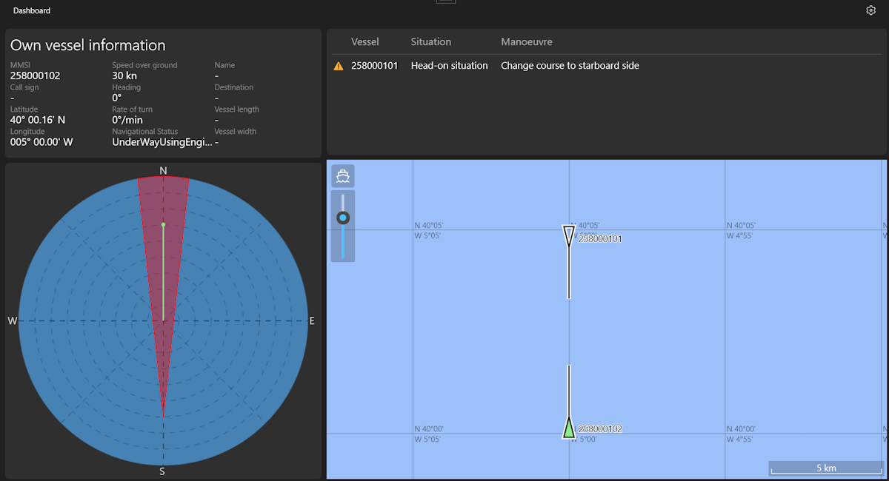

This project consists of the development of an application that assists in ship navigation and collision prevention. It
will be integrated with the Automatic Identification System (AIS), which will provide real-time location and navigation
data for all nearby ships. All this information will be decoded and processed to ultimately provide the user with a
simple visualization that can help them make decisions.

